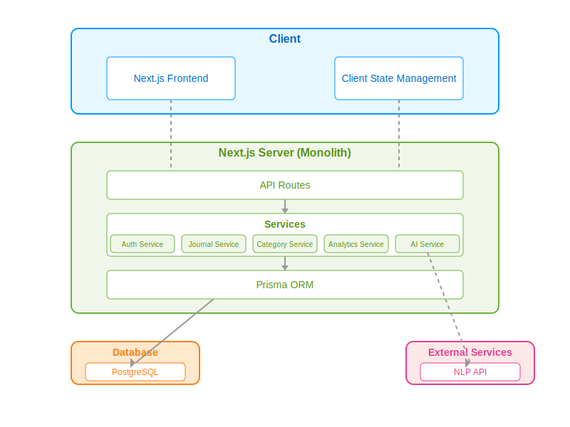
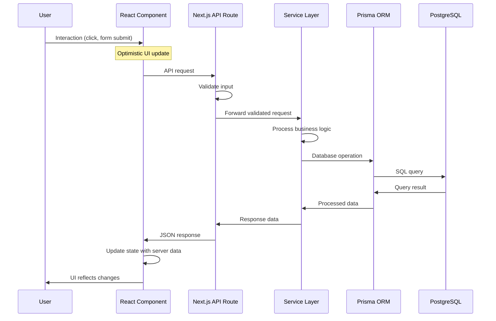
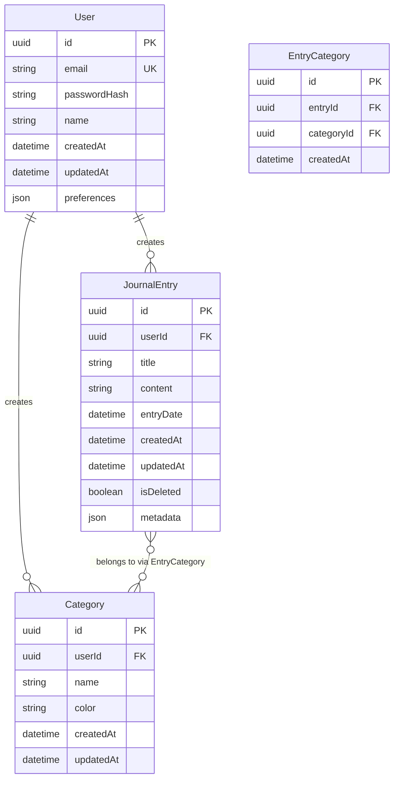

# System Design Document
## Personal Journaling Application

## Table of Contents
1. [Introduction](#1-introduction)
2. [Architecture Overview](#2-architecture-overview)
3. [Implementation Design](#3-implementation-design)
4. [Data Model](#4-data-model)
5. [API Specifications](#5-api-specifications)
6. [Security Measures](#6-security-measures)
7. [Performance Considerations](#7-performance-considerations)
8. [Scaling Design for 1M+ Users](#8-scaling-design-for-1m-users)
9. [Potential Bottlenecks and Solutions](#9-potential-bottlenecks-and-solutions)
10. [Monitoring and Maintenance](#10-monitoring-and-maintenance)

## 1. Introduction

This document outlines the system design for the Personal Journaling Application that allows users to create, manage, and analyze their journal entries. The application will provide features for categorization, search, analytics, and AI-enhanced insights. This design document addresses both the immediate implementation needs as well as considerations for scaling to support 1M+ users in the future.

### 1.1 Purpose

The purpose of this document is to:
- Define the architecture and components of the system
- Document the data model and relationships
- Specify the APIs and interfaces
- Address security and performance considerations
- Outline scaling strategies for future growth

### 1.2 Scope

This document covers the technical design of all major system components including frontend, backend, database, security, and external service integrations.

### 1.3 Audience

This document is intended for:
- Development team members
- Technical stakeholders
- System architects
- Security reviewers

## 2. Architecture Overview

The Personal Journaling Application uses a modern web application architecture with distinct frontend and backend components integrated into a cohesive whole.

### 2.1 High-Level Architecture

For our initial implementation, we've chosen a monolithic architecture using Next.js, which provides several advantages given our constraints:

- Faster development time with a unified codebase
- Simplified deployment process
- Reduced operational complexity
- Integrated API routes and frontend components
- Built-in server-side rendering capabilities

This approach allows us to deliver a complete solution within the 10-day timeframe while maintaining flexibility for future scaling.

 

### 2.2 Key Components

#### 2.2.1 Frontend
- Next.js React application
- Combination of Server-Side Rendering (SSR) and Client-Side Rendering (CSR)
- Responsive design for mobile and desktop
- TypeScript for type safety
- UI component library (Tailwind CSS)

#### 2.2.2 Backend
- Next.js API routes for RESTful endpoints
- Service layer for business logic
- Prisma ORM for database access
- Authentication and authorization middleware
- Input validation and sanitization

#### 2.2.3 Database
- PostgreSQL relational database
- Structured schema for users, entries, categories
- Indexing for performance optimization

#### 2.2.4 External Services
- Third-party NLP API for sentiment analysis
- ~~S3-compatible storage for attachments~~

## 3. Implementation Design

### 3.1 Next.js Monolith Structure

```
/
├── app/                # Next.js App Router pages
│   ├── api/            # API Route Handlers
│   │   ├── auth/       # Authentication endpoints
│   │   │   └── [...]/route.ts
│   │   ├── journal/    # Journal entry endpoints
│   │   │   └── [...]/route.ts
│   │   ├── categories/ # Category endpoints
│   │   │   └── [...]/route.ts
│   │   ├── analytics/  # Analytics endpoints
│   │   │   └── [...]/route.ts
│   │   └── ai/         # AI feature endpoints
│   │       └── [...]/route.ts
│   ├── (auth)/         # Authentication routes (grouped)
│   │   ├── login/page.tsx
│   │   ├── register/page.tsx
│   │   └── layout.tsx
│   ├── dashboard/      # Dashboard route
│   │   └── page.tsx
│   ├── entries/        # Journal entries routes
│   │   ├── [id]/page.tsx
│   │   ├── new/page.tsx
│   │   └── page.tsx
│   ├── categories/     # Categories management routes
│   │   ├── [id]/page.tsx
│   │   └── page.tsx
│   ├── insights/       # Analytics and insights routes
│   │   └── page.tsx
│   ├── layout.tsx      # Root layout
│   └── page.tsx        # Home page
├── components/         # React components
│   ├── auth/           # Authentication components
│   ├── journal/        # Journal entry components
│   ├── categories/     # Category management components
│   ├── analytics/      # Analytics and charts
│   ├── ui/             # Shared UI components
│   └── layout/         # Layout components
├── lib/                # Shared utilities and libraries
│   ├── prisma/         # Prisma client and schema
│   ├── auth/           # Authentication utilities
│   ├── validation/     # Input validation schemas
│   └── analytics/      # Analytics utilities
├── services/           # Business logic services
│   ├── auth.service.ts # Authentication service
│   ├── journal.service.ts # Journal entry service
│   ├── category.service.ts # Category service
│   ├── analytics.service.ts # Analytics service
│   └── ai.service.ts   # AI features service
├── public/             # Static assets
└── styles/             # Global styles
```

### 3.2 Service Layer Design

Each service encapsulates a specific domain of functionality:

#### 3.2.1 Authentication Service
- User registration and login
- Password management
- Session handling
- JWT generation and validation

#### 3.2.2 Journal Service
- CRUD operations for journal entries
- ~~Attachment handling~~
- ~~Version history tracking~~
- Entry search and filtering

#### 3.2.3 Category Service
- Category management
- Entry categorization
- Category statistics

#### 3.2.4 Analytics Service
- Writing frequency analysis
- Word count statistics
- Category distribution
- Time-based patterns

#### 3.2.5 AI Service
- Sentiment analysis integration
- Auto-categorization
- Theme detection
- ~~Writing prompts~~

### 3.3 Request Flow

1. User interaction triggers client-side action
2. React component calls API endpoint
3. API route handles request validation
4. Request is passed to appropriate service
5. Service performs business logic
6. Prisma ORM handles database operations
7. Response is returned through API route
8. Client-side state is updated (with optimistic updates)
9. UI reflects the changes



### 3.4 Optimistic Updates Implementation

To deliver a responsive user experience, we'll implement optimistic updates:

1. **Client-side state updates**: Immediately update the UI before server confirmation
2. **Temporary IDs**: Assign temporary IDs to new entries until server response
3. **Request queuing**: Handle concurrent operations properly
4. **Rollback mechanism**: Revert changes if the server request fails
5. **Synchronization**: Reconcile client state with server state when responses arrive

## 4. Data Model

### 4.1 Entity Relationship Diagram

The data model consists of these primary entities and their relationships:

1. **User**: Represents an application user
2. **JournalEntry**: Represents a single journal entry
3. **Category**: Represents a user-defined category for organizing entries
4. **EntryCategory**: Junction table for the many-to-many relationship between entries and categories

### 4.2 Schema Definition (Prisma Schema)



```prisma
model User {
  id            String         @id @default(uuid())
  email         String         @unique
  passwordHash  String
  name          String
  createdAt     DateTime       @default(now())
  updatedAt     DateTime       @updatedAt
  preferences   Json?
  journalEntries JournalEntry[]
  categories    Category[]
}

model JournalEntry {
  id          String         @id @default(uuid())
  userId      String
  title       String
  content     String
  entryDate   DateTime
  createdAt   DateTime       @default(now())
  updatedAt   DateTime       @updatedAt
  isDeleted   Boolean        @default(false)
  metadata    Json?
  user        User           @relation(fields: [userId], references: [id])
  entryCategories EntryCategory[]
}

model Category {
  id          String         @id @default(uuid())
  userId      String
  name        String
  color       String
  createdAt   DateTime       @default(now())
  updatedAt   DateTime       @updatedAt
  user        User           @relation(fields: [userId], references: [id])
  entryCategories EntryCategory[]

  @@unique([userId, name])
}

model EntryCategory {
  id            String         @id @default(uuid())
  entryId       String
  categoryId    String
  createdAt     DateTime       @default(now())

  entry         JournalEntry  @relation(fields: [entryId], references: [id])
  category      Category      @relation(fields: [categoryId], references: [id])

  @@unique([entryId, categoryId])
}
```

### 4.3 Data Model Design Decisions

#### 4.3.1 Soft Deletion
We use an `isDeleted` flag instead of permanently removing entries to:
- Allow users to recover accidentally deleted entries
- Maintain data integrity for analytics
- Enable a "trash" feature in the future

#### 4.3.2 Flexible Metadata
We use a JSON field for metadata to:
- Store varying additional data with entries (mood, location)
- Support future feature extensions without schema changes
- Allow for different types of entries with different metadata needs

#### 4.3.3 Entry Date vs. Creation Date
We separate `entryDate` from `createdAt` to:
- Allow backdating of entries
- Support accurate temporal analytics
- Enable future scheduling of entries

#### 4.3.4 Many-to-Many Relationships
We implement a many-to-many relationship between entries and categories to:
- Allow entries to belong to multiple categories
- Support more flexible organization
- Enable richer filtering and analytics

#### 4.3.5 User-Specific Categories
Categories belong to specific users rather than being global to:
- Ensure privacy and data separation
- Allow personalized category systems
- Prevent category name conflicts between users

## 5. API Specifications

The API follows RESTful principles with resource-based endpoints.

: explain add pagination to relevant sections 

### 5.1 Authentication Endpoints

```
POST /api/auth/register
POST /api/auth/login
POST /api/auth/logout
POST /api/auth/refresh-token
POST /api/auth/forgot-password
POST /api/auth/reset-password
GET  /api/auth/me
```

### 5.2 Journal Entry Endpoints

```
GET    /api/journal
POST   /api/journal
GET    /api/journal/:id
PUT    /api/journal/:id
DELETE /api/journal/:id
GET    /api/journal/search?q=:query&categories=:ids
```

### 5.3 Category Endpoints

```
GET    /api/categories
POST   /api/categories
GET    /api/categories/:id
PUT    /api/categories/:id
DELETE /api/categories/:id
GET    /api/categories/:id/entries
```

### 5.4 Analytics Endpoints

```
GET /api/analytics/writing-frequency
GET /api/analytics/category-distribution
GET /api/analytics/word-counts
GET /api/analytics/time-patterns
```

### 5.5 AI Feature Endpoints

```
POST /api/ai/analyze-sentiment
POST /api/ai/suggest-categories
GET  /api/ai/writing-prompts
POST /api/ai/detect-themes
```

### 5.6 Sample Request/Response

**Request:**
```http
POST /api/journal HTTP/1.1
Content-Type: application/json
Authorization: Bearer <token>

{
  "title": "Morning Reflection",
  "content": "Today I woke up feeling refreshed and ready to tackle the day...",
  "entryDate": "2025-03-26T08:30:00Z",
  "categoryIds": ["uuid-1", "uuid-2"]
}
```

**Response:**
```http
HTTP/1.1 201 Created
Content-Type: application/json

{
  "id": "uuid-entry-1",
  "title": "Morning Reflection",
  "content": "Today I woke up feeling refreshed and ready to tackle the day...",
  "entryDate": "2025-03-26T08:30:00Z",
  "createdAt": "2025-03-26T08:35:12Z",
  "updatedAt": "2025-03-26T08:35:12Z",
  "isDeleted": false,
  "categories": [
    {
      "id": "uuid-1",
      "name": "Personal",
      "color": "#3182ce"
    },
    {
      "id": "uuid-2",
      "name": "Morning",
      "color": "#dd6b20"
    }
  ]
}
```

## 6. Security Measures

### 6.1 Authentication Security

- **Password hashing**: Using bcrypt with appropriate work factor
- **JWT tokens**: Short-lived access tokens (15 minutes)
- **Refresh tokens**: HTTP-only, secure cookies for longer sessions (7 days)
- **CSRF protection**: Using double-submit cookie pattern
- **Rate limiting**: On login/registration endpoints to prevent brute force

### 6.2 Data Protection

- **Input validation**: Using Zod schema validation for all inputs
- **Output sanitization**: Preventing XSS by sanitizing output
- **SQL injection protection**: Using Prisma's parametrized queries
- **Content Security Policy**: Restricting resource origins
- ~~**Sensitive data encryption**: For particularly private journal entries~~

### 6.3 API Security

- **Authentication middleware**: Validating JWT on protected routes
- **Authorization checks**: Ensuring users can only access their own data
- **Request validation**: Checking content-type, size limits, etc.
- **Error handling**: Providing generic errors without exposing system details
- **Audit logging**: Tracking security-relevant actions

### 6.4 Environmental Security

- **Environment variables**: For sensitive configuration
- **HTTPS enforcement**: For all communications
- **Dependency scanning**: Regular checks for vulnerabilities
- ~~**Content validation**: For user-uploaded files~~

## 7. Performance Considerations

### 7.1 Database Optimization

- **Indexing strategy**:
  - Indexes on userId for quick filtering
  - Composite indexes for common queries (userId + isDeleted + entryDate)
  - Full-text search indexes for content search

- **Query optimization**:
  - Limit fetched fields to what's needed
  - Use pagination for large result sets
  - Eager loading to avoid N+1 query problems

### 7.2 Frontend Performance

- **Code splitting**: Loading only needed JavaScript
- **Image optimization**: Using Next.js image optimization
- **Caching strategy**: For static assets and API responses
- **Lazy loading**: For off-screen content
- **Bundle size optimization**: Tree-shaking unused code

### 7.3 API Performance

- **Response compression**: Using gzip/brotli
- **Pagination**: Limiting result set sizes
- **Caching headers**: For appropriate responses
- **Request batching**: For multiple related operations

## 8. Scaling Design for 1M+ Users

For scaling to support 1M+ users, we would transition from the monolithic architecture to a more distributed system.

### 8.1 Scaled Architecture Overview


### 8.2 Key Components in Scaled Design

#### 8.2.1 Frontend Layer
- Static assets served through CDN
- Server-side rendering moved to dedicated rendering service
- Mobile applications supported through API

#### 8.2.2 API Gateway
- Central entry point for all API requests
- Authentication and rate limiting at the gateway level
- Request routing to appropriate microservices
- API versioning support
- Request/response logging

#### 8.2.3 Microservices
- Split monolith into domain-specific services:
  - Authentication Service
  - Journal Entry Service
  - Category Service
  - Analytics Service
  - AI/ML Service
  - Search Service
  - Notification Service
- Each service has its own deployment, scaling, and database access

#### 8.2.4 Database Layer
- Primary PostgreSQL database for writes
- Read replicas for read-heavy operations
- Database sharding by user ID for horizontal scaling
- Elasticsearch/zincsearch for full-text search capabilities

#### 8.2.5 Caching Layer
- Redis for distributed caching
- Cache frequently accessed data

#### 8.2.6 Background Processing
- Message queue (RabbitMQ) for asynchronous tasks
- Worker servers for processing

#### 8.2.7 Storage Layer
- Object storage (S3) for:
  - Attachments
  - Export files
  - Backup data

#### 8.2.8 Monitoring and Observability
- Centralized logging
- Metrics collection
- Distributed tracing
- Alerting system

### 8.3 Database Scaling Strategy

#### 8.3.1 Vertical Scaling
- Initially scale up the database server (more CPU, memory)
- Optimize existing queries and indexes
- Implement read replicas for read-heavy operations

#### 8.3.2 Horizontal Scaling
- Implement sharding based on user ID
- Each shard contains a complete set of user data
- Shard router to direct queries to appropriate database

#### 8.3.3 Data Access Patterns
- Service-specific databases where appropriate
- Metadata database for global information
- NoSQL solutions for specific use cases:
  - Time-series data for analytics
  - Document store for full-text search

### 8.4 API Scaling Strategy

#### 8.4.1 Load Balancing
- Distribute traffic across multiple API instances
- Health checks to route around failures
- Sticky sessions where needed

#### 8.4.2 Caching Strategy
- Multi-level caching:
  - Browser cache
  - CDN cache
  - API response cache
  - Database query cache
- Cache invalidation strategy
- Cache warming for predictable access patterns

#### 8.4.3 Request Throttling
- User-based rate limits
- Gradual degradation under load
- Priority queues for critical operations

## 9. Potential Bottlenecks and Solutions

### 9.1 Database Bottlenecks

#### 9.1.1 Write Contention
- **Bottleneck**: High volume of journal entries being created or updated
- **Solution**: 
  - Database sharding by user ID
  - Batching writes
  - Write-behind caching

#### 9.1.2 Complex Queries
- **Bottleneck**: Analytics queries scanning large datasets
- **Solution**:
  - Pre-aggregation of analytics data
  - Materialized views
  - Dedicated analytics database

#### 9.1.3 Full-text Search
- **Bottleneck**: Searching across millions of journal entries
- **Solution**:
  - Dedicated search service
  - Asynchronous indexing

### 9.3 Network Bottlenecks

#### 9.3.1 API Latency
- **Bottleneck**: High latency for users in different regions
- **Solution**:
  - Global CDN
  - Regional API deployments
  - Edge computing for some operations

#### 9.3.2 Large Payload Transfers
- **Bottleneck**: Transferring large attachments or exports
- **Solution**:
  - Direct-to-storage uploads
  - Progressive loading
  - Compression

### 9.4 Frontend Bottlenecks

#### 9.4.1 Initial Load Time
- **Bottleneck**: Slow first-time loading experience
- **Solution**:
  - Code splitting
  - Server-side rendering
  - Progressive web app capabilities

#### 9.4.2 State Management
- **Bottleneck**: Complex state synchronization with server
- **Solution**:
  - Optimistic updates
  - Efficient delta updates
  - Background synchronization

## 10. Monitoring and Maintenance

### 10.1 Monitoring Strategy

#### 10.1.1 System Metrics
- Server resource utilization (CPU, memory, disk)
- Database performance (query times, connections)
- API response times and error rates
- Background job processing rates

#### 10.1.2 Business Metrics
- User activity (logins, entries created)
- Feature utilization
- Error rates and types
- Performance against SLAs

### 10.2 Logging Strategy

#### 10.2.1 Centralized Logging
- Application logs
- Access logs
- Error logs
- Audit logs for security events

#### 10.2.2 Log Levels
- Debug: Detailed development information
- Info: General operational information
- Warning: Non-critical issues
- Error: Runtime errors
- Critical: System failures

### 10.3 Alerting Strategy

#### 10.3.1 Proactive Alerts
- Resource utilization thresholds
- Error rate spikes
- Performance degradation
- Security incidents

#### 10.3.2 Alert Channels
- Email for non-urgent issues
- SMS/push notifications for critical issues
- Dashboard for visual monitoring
- Incident management integration

### 10.4 Backup and Recovery

#### 10.4.1 Backup Strategy
- Daily full database backups
- Point-in-time recovery capability
- Geographically distributed backup storage
- Regular backup restoration testing

#### 10.4.2 Disaster Recovery
- Recovery time objective (RTO): 4 hours
- Recovery point objective (RPO): 15 minutes
- Documented recovery procedures
- Regular disaster recovery drills